# CodeReady and Quarkus In A Box

This repo is related to a slide deck and a series of videos that will guide the user through a workshop to achieve the following:
* Gain an introductory knowledge of Quarkus -- Supersonic Subatomic Java
* Build, run and scale Quarkus containers on the OpenShift Kubernetes platform
* Build and deploy some Quarkus code to OpenShift from CodeReady Workspaces

## Prerequisites and Operating Environment

### **It is assumed that you have access to an OpenShift cluster.**

This demo is operating system agnostic; you can use macOS, Linux or Windows, since you'll be using a web browser exclusively.

## Prepare for Quarkus in OpenShift with CodeReady Workspaces
### Create cluster
1. Create an OpenShift cluster  
1. Log into dashboard as administrator

### Create a project for our workshop. 
* Click on "Projects" on the left-hand menu on the dashboard.  

  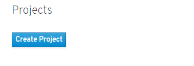 

* Click on the "Create Project" button on the dashboard and fill in the following values:  
  
  Name: quarkus  
  Display Name: Quarkus and Kafka Demo  

  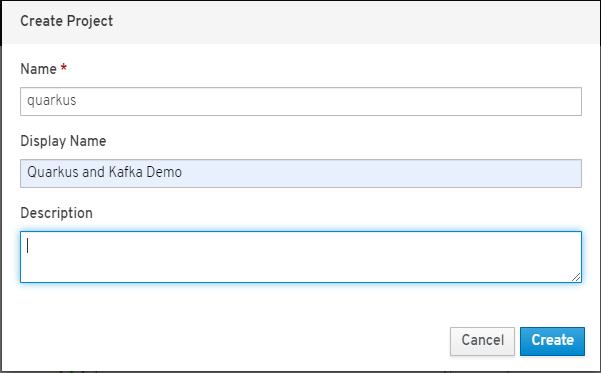 

* Click the "Create" button.

Now that we have a cluster and a project, we're going to install some operators in the project, including CodeReady Workspaces.

### Install AMQ Streams Operator from OperatorHub

* Expand the Catalog section of the menu by clicking once on "Catalog". You will see a list of catalogs.  

  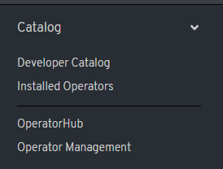

* Proceed to the OperatorHub by clicking once on "OperatorHub". You have have the OpenShift OperatorHub displayed, with dozens of operators available.

  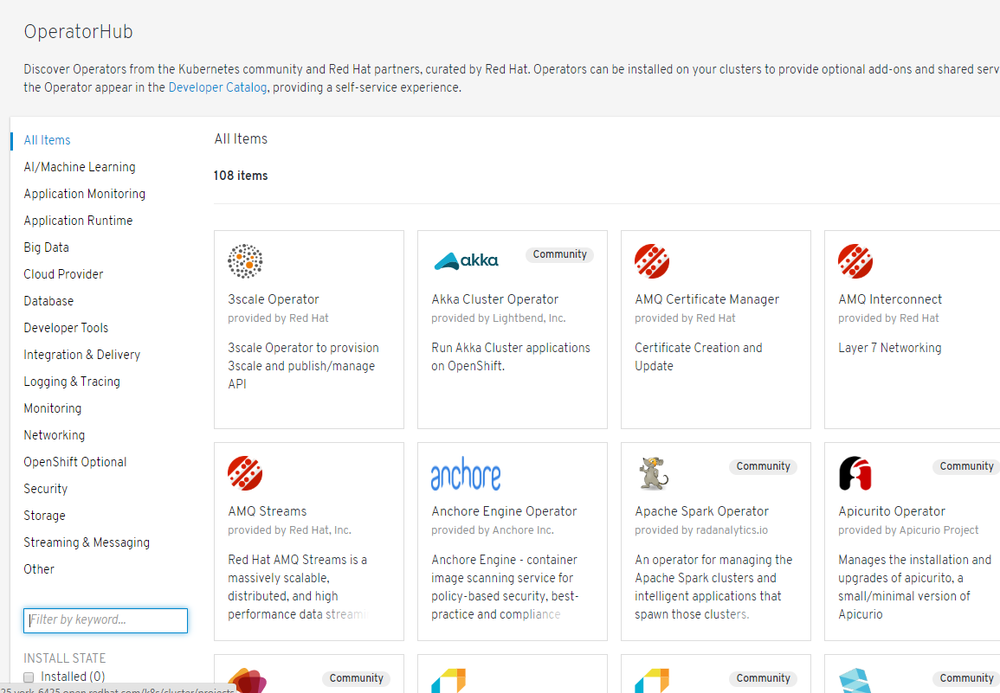

* Find the operator entitled "AMQ Streams" (provided by Red Hat, Inc.).

  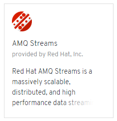  

* Click once on the tile; you will be prompted to install AMQ Streams.

  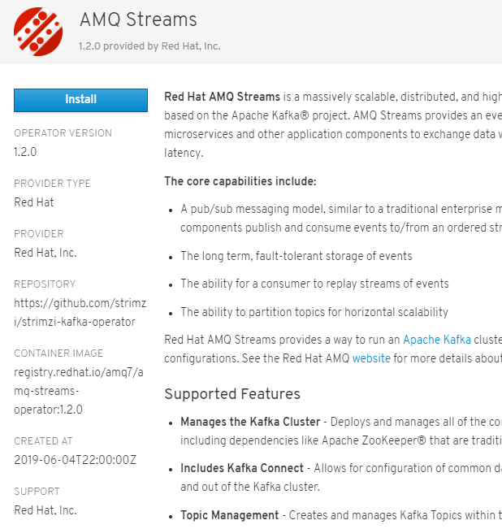  

* Click the "Install" button to begin the installation. You are then given to opportunity to change some settings. Leave the choices as-is and click the "Subscribe" button. 

  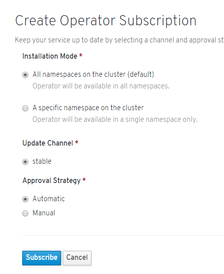  

### Create Kafka Instance

* Click on "Installed Operators" on the left-hand menu. You will see the AMQ Stream operator listed. If you do not see it, wait a few minutes until it appears. Wait until you see the STATUS switch to "InstallSucceeded".

  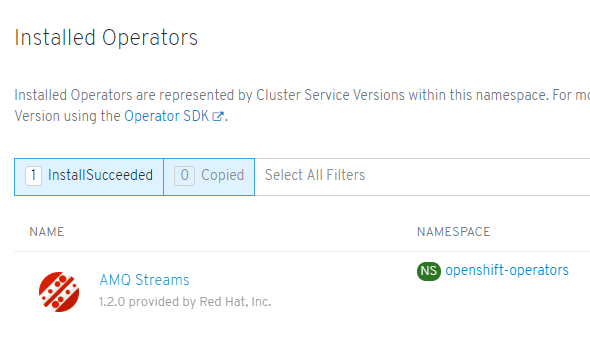  
  
  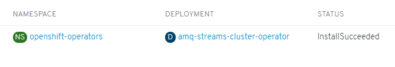  

* Under the "PROVIDED APIS" heading for the AMQ Streams operation, you can see Kafka apis. We will select the "Kafka" api. Begin the installation by clicking once on the Kafka link.

  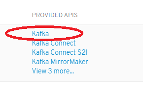  

* The next screen provides you with a list of running Kafka instances. There should be none. Click the "Create Kafka" button to continue.

  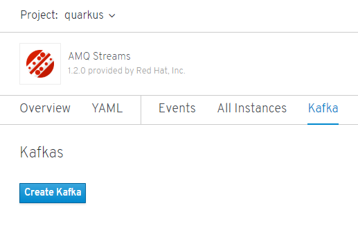  

* You are now shown the YAML that is used to create the Kafka instance. You can make changes as necessary -- we will not be making any changes.

* Note of the "name:" value in the meta data near the top. This value, "my-cluster", will be needed for the Java code we'll be running. Of course, since this is a pre-packaged demo, the value is already supplied in the Java code. But this is important to note.
  
  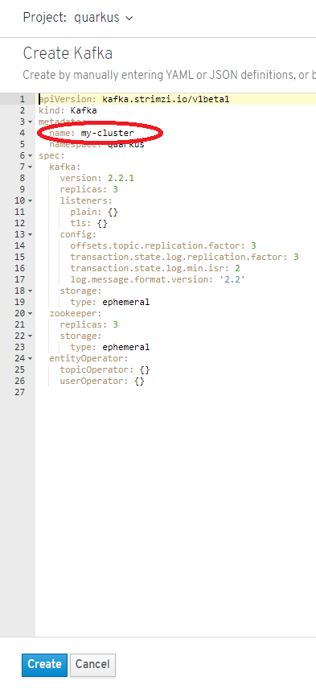  

* Click the "Create" button and the Kafka cluster running in OpenShift will start to build. It will be available for use by your applications in a few minutes.

* With the AMQ Streams panel being displayed, click on the "my-cluster" link.

  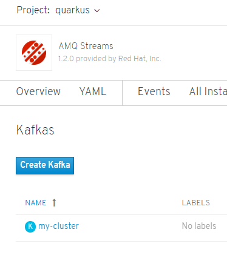  

* Details about the cluster are displayed. Click on the YAML heading to view the yaml associated with the created cluster.

  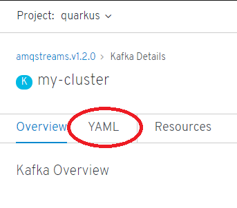  

* Make special note of the "host:" listed near the bottom. This value will be used later in the Java code. Again; since this is a pre-package demo, the value is already supplied in the Java code. But this, too, is important to note.

  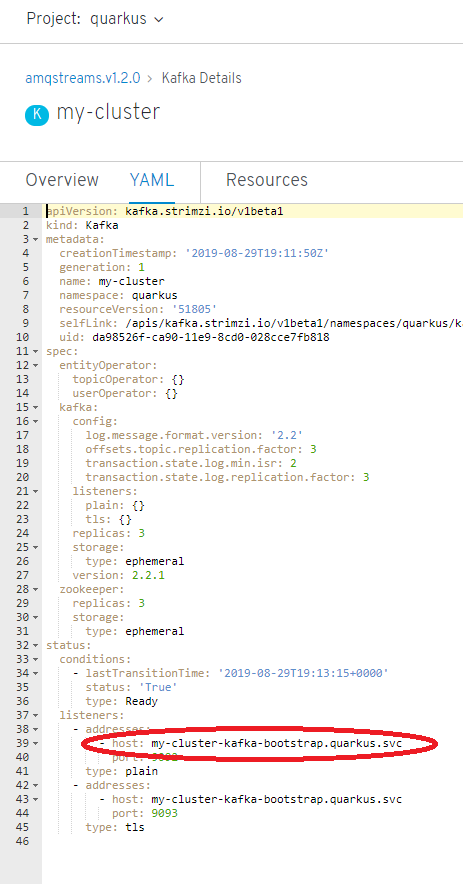  

  **A note about naming:** Throughout this demo/workshop, we have made assumptions about naming. In a real-world situation you would, in fact, do the same thing. One of the values of intentionally scripting and documenting your infrastructure is that *you* can assign names before they make it into code -- or vice-versa -- and have complete control.

### "The host isn't listed"
That's because it may take a few minutes for the kafka instance to start. Wait a few minutes and reload the YAML. Repeat this until the host appears.

Example: my-cluster-kafka-bootstrap.openshift-operators.svc

### Install CodeReady Workspaces from OperatorHub
* Click on the "OperatorHub" option on the left-hand menu.
* Find the card labeled "Red Hat CodeReady Workspaces" (provided by Red Hat, Inc.). Click on the card to begin.

  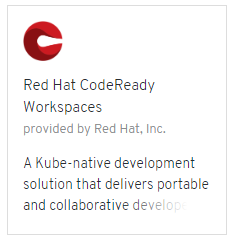  

* When prompted, click the "Install" button.

  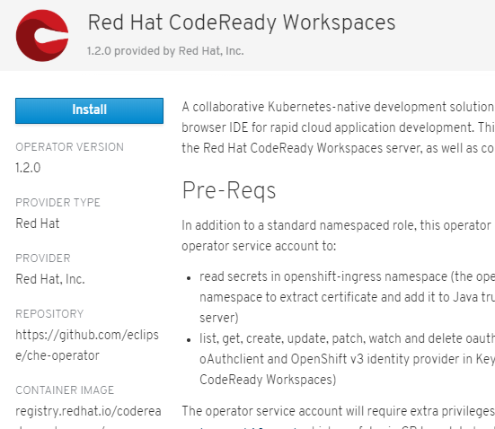  

* When the screen titled "Create Operator Subscription" is presented, change the value for "A specific namespace on the cluster" to "quarkus". No other values need to be changed.
* Click the "Subscribe" button to continue.

  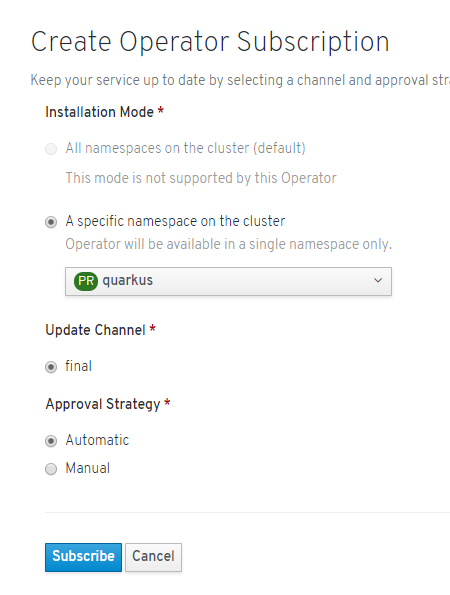  

#### Create Che Cluster
* Wait until the codeready-workspaces operator status reveals "1 installed".

  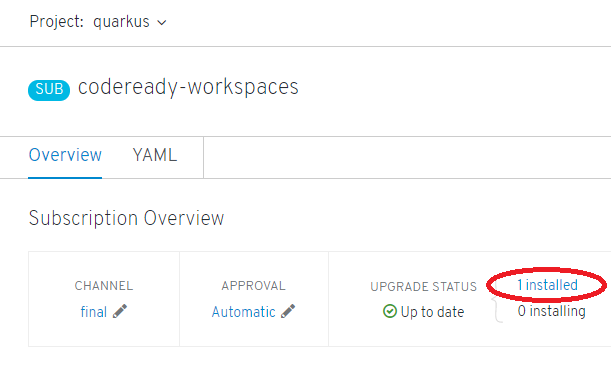  

* Click on the Installed Operators option on the left-hand menu to display the "Installed Operators" panel. Here you will see the Red Hat CodeReady Workspaces opertor.

  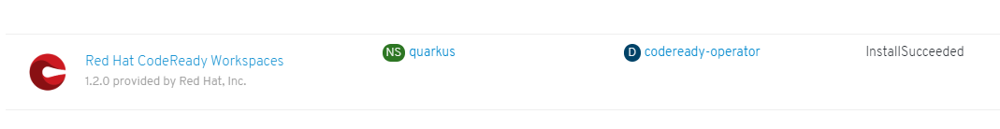  

* When the status shows "InstallSucceeded", click on the provided API labeled "Red Hat CodeReadby Workspaces Cluster".

  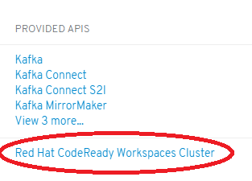  

* At the "Che Clusters" page, click on the button labeled "Create Che Cluster".

  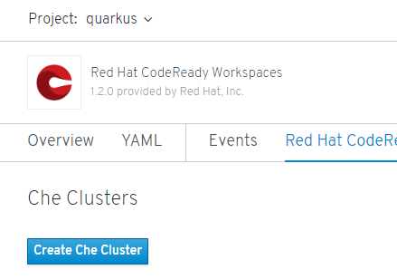  

* When the YAML is displayed, simply click the "Create" button at the bottom.

**This will take several minutes.**

* Expand the "Networking" section of the left-hand menu and click on the "Route" link

  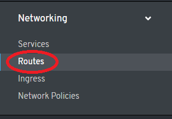

* When a route appears for "codeready", your CodeReady Workspaces instance is ready for use. The supplied URL will take you there; click on it.

  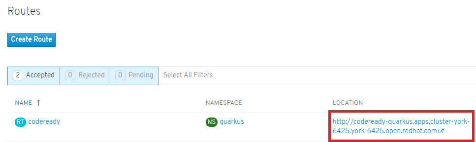

If you get the "Application is not available" error, that means the CodeReady Workspaces installation isn't 100 percent complete. Wait a bit a keep refreshing the browser until it is ready. It may take as long at ten minutes.

(That's fine; this is a one-time setup. That is: Once you have CodeReady Workspaces up and running, your developers will not wait for it; it will always be only a URL away.)

* Log in as user "admin" with password "admin". You will see the "New Workspaces" panel.

  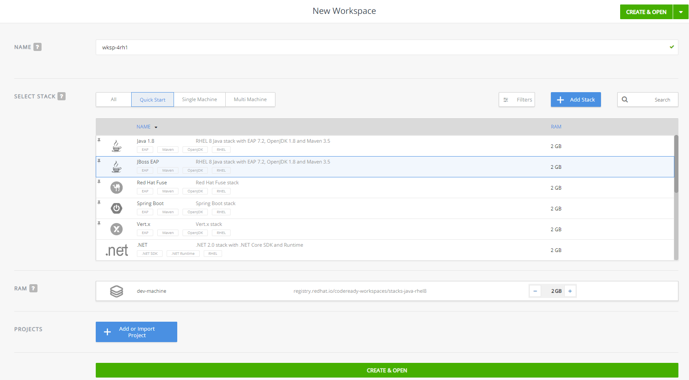

## Quarkus with CodeReady Workspaces
Now the hardest part of this demo: Creating the custom stack.

### Create Java + Quarkus + odo stack
Creating a custom stack involves copying and pasting some JSON.

* Open your CodeReady Workspaces in a browser and log in as user 'admin', using password 'admin'.

* Change the URL to match the following pattern:

${CHE_HOST}/swagger/#!/stack/createStack

* For example: 
http://codeready-quarkus-demo.apps.cluster-york-b654.york-b654.openshiftworkshop.com/swagger/#!/stack/createStack

  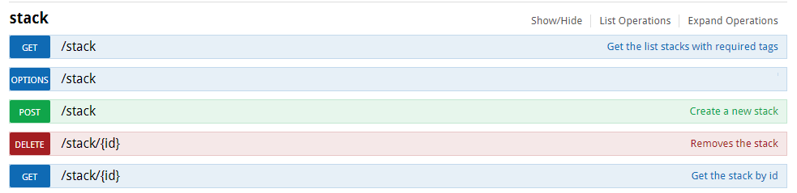 

* Expand the "POST" operation by clicking on the word "POST". Within the context of the POST operation, you will see a textbox labeled "body". You will paste a JSON document into that textbox. The document can be found at https://raw.githubusercontent.com/DonSchenck/crw-quarkus-ocp/master/stack.json.

  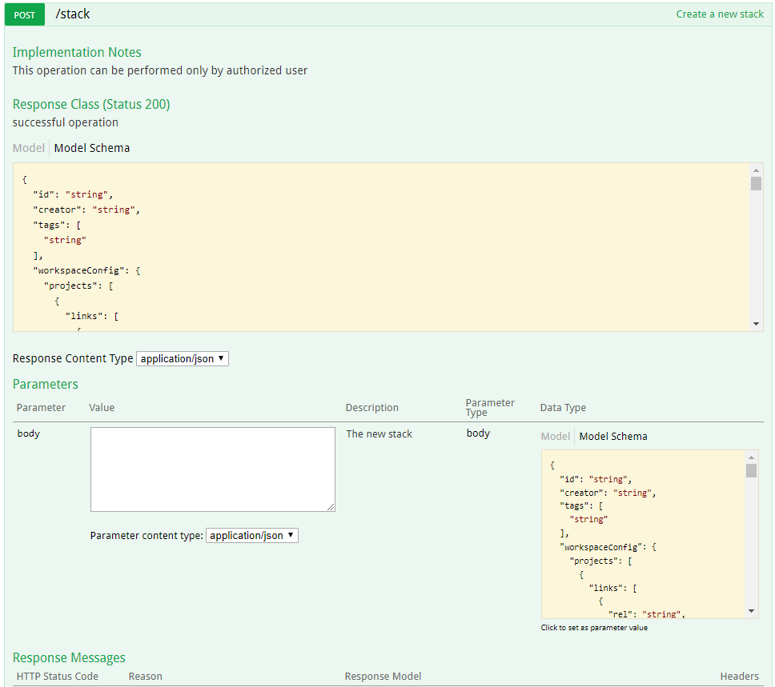  

* Paste the contents of that JSON document into the "body" textbox and click the "Try it out!" button (a little bit further down the page, at the end of the POST section).

  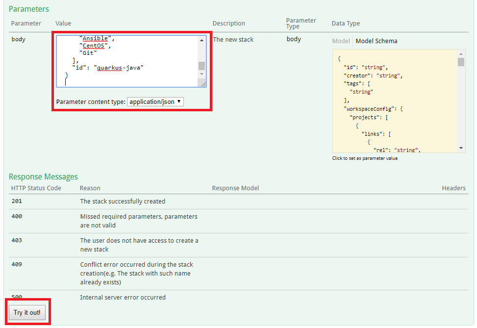  

* Verify that the stack was correctly built by checking the Response Code; if it read "201", it was successful.

  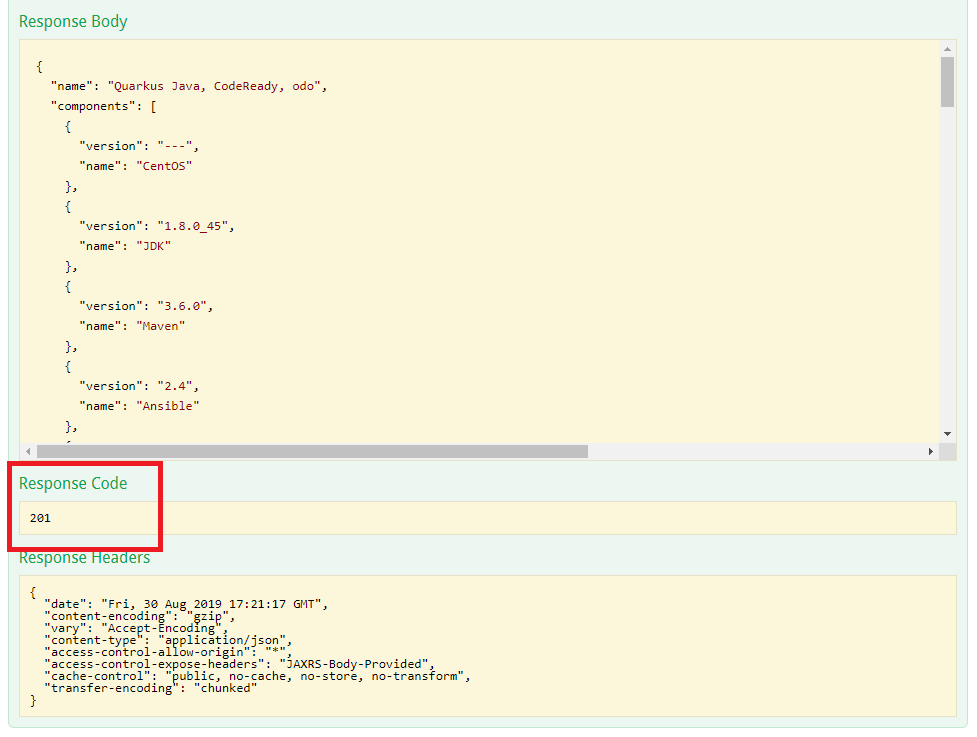 

* Now when you return to the CodeReady Workspaces dashboard and select "Stacks", you will see the new "Quarkus Java, CodeReady, odo" stack listed.

  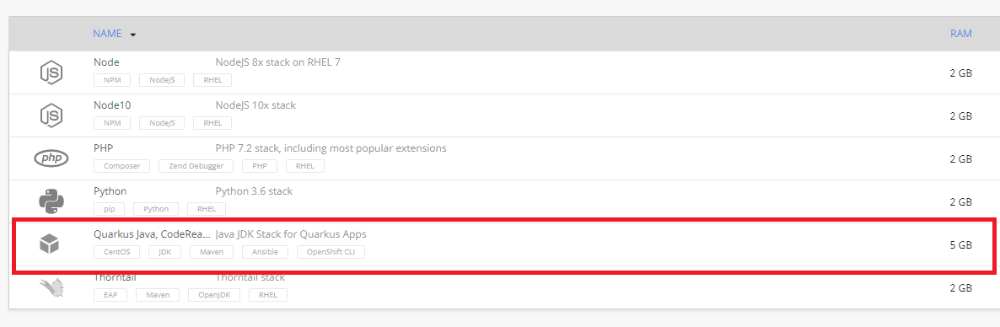 

#### Create Java + Quarkus + odo workspace
* Click on "Workspaces" on the left-hand menu.

* Click the "Add Workspace" button.

  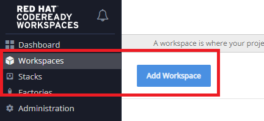 

* Change the workspace name to 'quarkus' (no quotes).

  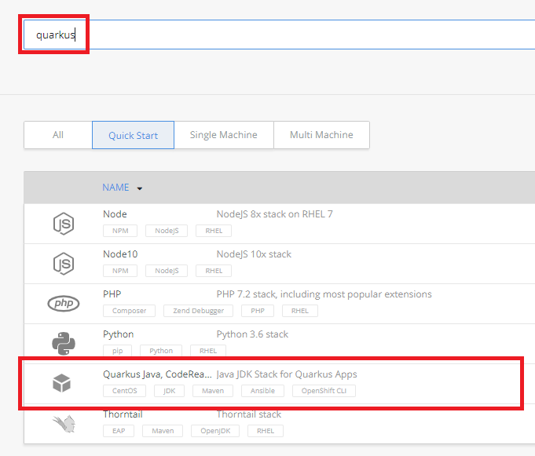

* Select the custom stack that was created in the previous section.

* Click the large, green "CREATE & OPEN" button at the bottom of the page.

After a few minutes, your workspace will be ready.
IF YOU GET AN ERROR, simply click on the link supplied to try again.

#### Import Quarkus project from Github
Now that the workspace is running and open, we can import the project from Github.  

* Click on the "Import Project..." link in the center of the page.

  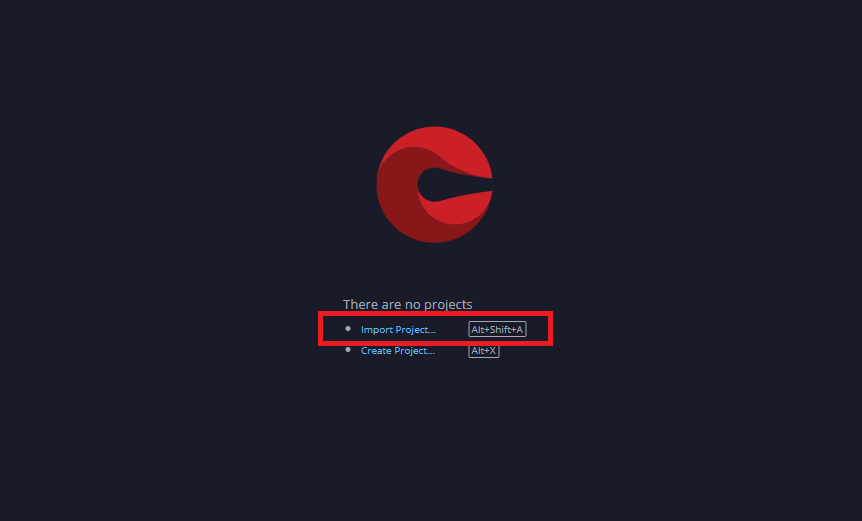 

* Select GITHUB as the Version Control System and enter the following URL: https://github.com/donschenck/crw-quarkus-ocp.

  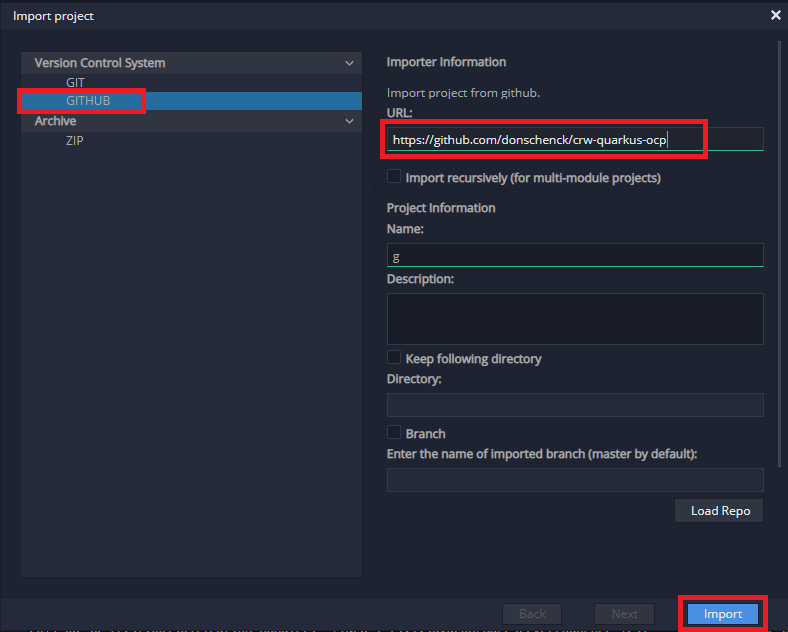 

* Click the "Import" button. In a few seconds the project will be imported. You will be prompted for the Project Configuration. Select JAVA --> Maven and then click the "Save" button.

  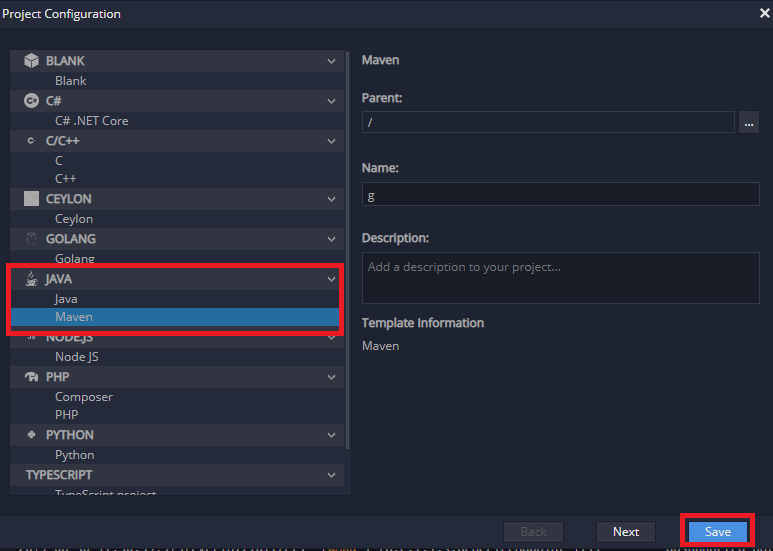 

#### Start Live Coding
* In the upper right corner, locate and click on the Commands Palette icon. From the dialog box, double-click the "Start Live Coding" entry.

  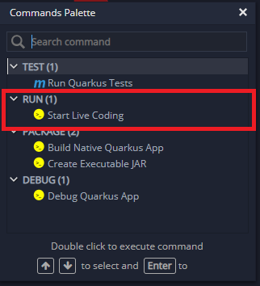 

* After a few seconds the code will be running. Click on the supplied URL to go to the web page.

  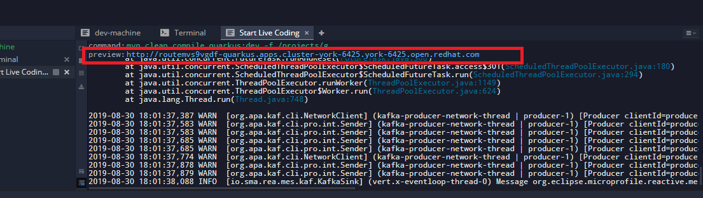 

#### See results in browser

*If the page does not display, wait a few seconds and refresh the browser. Continue this until you see a page similar to the following:

  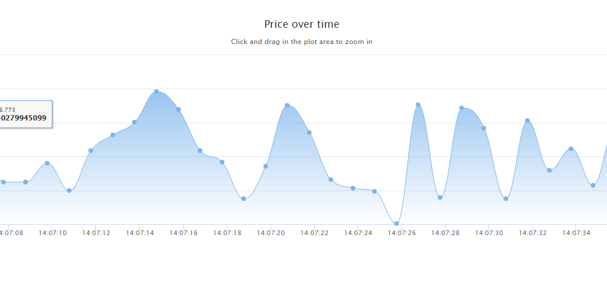 

#### Change code
Quarkus has a feature known as "Live Coding", where the output will update in seconds as you code in CodeReady Workspaces.

Now that the code is running and generating events, we can change the code and Quarkus will, on-the-fly, update the results. 

* Locate the file "PriceGenerator.java" in the CodeReady IDE and change the following line  

        return Flowable.interval(1000, TimeUnit.MILLISECONDS)
                .map(tick -> random.nextInt(100));

  to

        return Flowable.interval(1000, TimeUnit.MILLISECONDS)
                .map(tick -> random.nextInt(1000));

  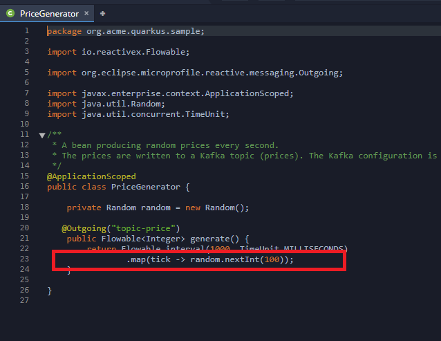 

#### See results updated almost immediately

* Now switch back to the browser and refresh the screen. You will see the output change; specifically, the Y axis will change to reflect our range of values. Previously the Price Generator was creating prices from zero to 100. Now it is creating prices from zero to 1,000. This is the power of Quarkus' "Live Coding" ability.
 
 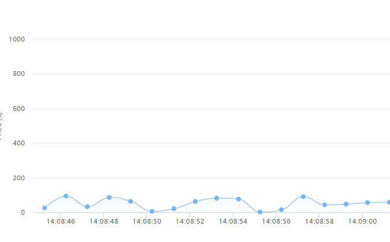 

 ## Recap

 In this demo/workshop, we have:
 1. Created a Kafka instance in OpenShift
 1. Created a CodeReady Workspaces (CRW) instance in OpenShift
 1. Created a Custom Stack in CRW.
 1. Created a Workspace in CRW using our Custom Stack.
 1. Imported a Github project into our workspace.
 1. Launched the Quarkus application from within CRW in a Live Coding environment.
 1. Altered the Quarkus application source code and viewed the instant results.

 

